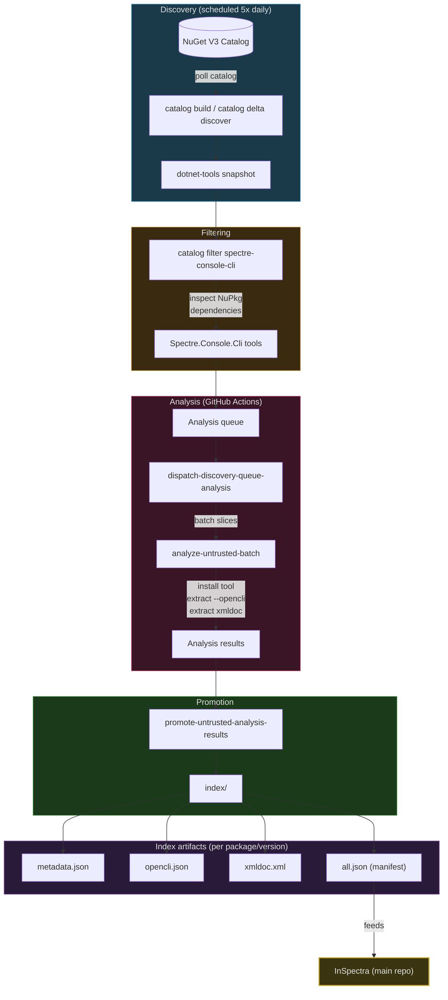

# InSpectra-Discovery

> **Companion repository for [InSpectra](https://github.com/JKamsker/InSpectra).**
> This repo handles the automated discovery, filtering, and analysis of .NET CLI tools, with scheduled Spectre.Console.Cli discovery plus generic help-based indexing across other CLI frameworks. The resulting index feeds the main InSpectra project.

## What it does

InSpectra-Discovery is an automated pipeline that:

1. **Discovers** all dotnet-tool packages published on NuGet via the V3 catalog API.
2. **Filters** packages into analysis queues, including scheduled `Spectre.Console.Cli` discovery and manual/research-driven framework batches.
3. **Analyzes** each tool by installing it in a sandbox, extracting its CLI structure from native `--opencli`, XML documentation, or a generic recursive `--help` crawl.
4. **Maintains** a versioned index of analyzed tools with metadata, CLI structure, and documentation artifacts.
5. **Runs continuously** via GitHub Actions workflows that detect new/updated packages and queue them for analysis.

## Pipeline overview



## Repository structure

```
src/InSpectra.Discovery.Tool/        # .NET 8 tool/CLI (discovery, analysis, promotion)
scripts/                             # Legacy/manual PowerShell helpers
.github/workflows/                   # CI/CD pipelines (scheduled discovery, batch analysis)
docs/Plans/                          # Reusable checked-in analysis plans
index/                               # Output: analyzed tool index (all.json + per-package artifacts)
state/                               # Persistent state (catalog cursors, queues, deltas)
tests/                               # xUnit tests
```

## How it works

### Discovery

The discovery tool enumerates NuGet's autocomplete and registration APIs to build a snapshot of all dotnet-tool packages, enriched with download counts:

```bash
dotnet run --project src/InSpectra.Discovery.Tool -- catalog build --concurrency 16
```

Incremental updates use the NuGet catalog cursor to detect only new or changed packages:

```bash
dotnet run --project src/InSpectra.Discovery.Tool -- catalog delta discover
```

### Filtering

Packages are filtered to those that depend on `Spectre.Console.Cli`, inspecting NuPkg archives for dependency evidence:

```bash
dotnet run --project src/InSpectra.Discovery.Tool -- catalog filter spectre-console-cli --concurrency 16
```

### Analysis

Discovered tools are analyzed via the discovery CLI, which installs each tool in a sandbox, extracts its CLI structure, and parses XML documentation:

```powershell
dotnet run --project src/InSpectra.Discovery.Tool -- analysis run-untrusted --package-id JellyfinCli --version 0.1.16 --output-root artifacts/analysis/jellyfincli --batch-id manual
```

For non-Spectre tools that do not expose native `--opencli`, the generic help crawler can run a checked-in batch plan and emit a promotion-ready `expected.json`:

```powershell
dotnet run --project src/InSpectra.Discovery.Tool -- analysis run-help-batch --plan docs/Plans/validated-generic-help-frameworks.json --output-root artifacts/help-batches/validated-frameworks --source help-index-batch
dotnet run --project src/InSpectra.Discovery.Tool -- promotion apply-untrusted --download-root artifacts/help-batches/validated-frameworks
```

The sample plan in [docs/Plans/validated-generic-help-frameworks.json](docs/Plans/validated-generic-help-frameworks.json) covers validated representatives for `CliFx`, `Argu`, `McMaster.Extensions.CommandLineUtils`, `Spectre.Console.Cli`, `Cocona`, `DocoptNet`, `System.CommandLine`, `CommandLineParser`, `Mono.Options / NDesk.Options`, `Microsoft.Extensions.CommandLineUtils`, `ConsoleAppFramework`, `CommandDotNet`, and `PowerArgs`.

Items can declare `"analysisMode": "help"` or `"analysisMode": "native"`. `run-help-batch` only executes the `help` items and records the others in the plan's `skipped` array. The checked-in plan uses that for `Cake.Tool`, which stays indexed through the richer native OpenCLI/XMLDoc path instead of being downgraded to a help-only partial entry.

### Output artifacts

Each analyzed tool produces versioned artifacts under `index/packages/{packageId}/{version}/`:

| File | Description |
|---|---|
| `metadata.json` | Package info, detection results, introspection status, timing data |
| `opencli.json` | Parsed CLI command structure |
| `xmldoc.xml` | Extracted XML documentation |

A global manifest at `index/all.json` lists all indexed packages with their latest status.

## CI/CD

| Workflow | Schedule | Purpose |
|---|---|---|
| `discover-dotnet-tool-updates` | 5x daily | Polls NuGet catalog for new/updated tools |
| `dispatch-discovery-queue-analysis` | On demand | Slices the analysis queue into batches |
| `analyze-untrusted-batch` | On demand | Runs sandboxed analysis on queued tools |
| `promote-untrusted-analysis-results` | On demand | Promotes successful results into the main index |
| `queue-indexed-metadata-backfill` | On demand | Backfills historical versions for indexed packages |

## Prerequisites

- .NET 10.0 SDK
- PowerShell 7+ for legacy/manual scripts only

## Building and testing

```bash
dotnet build InSpectra.Discovery.sln
dotnet test
```

## License

See the main [InSpectra](https://github.com/JKamsker/InSpectra) repository for license information.
